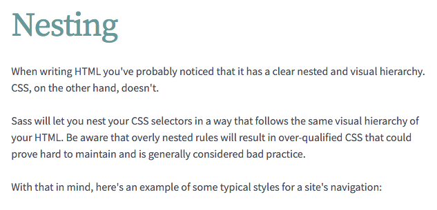

# How to Optimize a Framework

Responsive Web Design Summit 2016


**Get the slides on GitHub:**

<https://github.com/gakimball/rwd-summit-2016>


# I'm Geoff Kimball.

I'm a designer at **ZURB** and the lead on the **Foundation project.**

- **Twitter:** @geoffkimball
- **GitHub:** gakimball


# Foundation 6

We launched Foundation 6 last November. These were the hot new features:

- Accessibility
- Responsive menus
- More flexible Sass
- **A way slimmer codebase.**


Compressed CSS sizes:

- Foundation 5.5: **145KB**
- Foundation 6.0: **60KB**

**That's a 60% reduction!**


# How Does That Happen?

Let's break it down into Three Weird Tricks.

*Framework developers HATE him!*


# #1: Aggressively Audit Everything


We write our CSS using Sass. It's a great tool to keep a large codebase like Foundation's organized.

However, like any tool, you need to know the caveats of using it. With Sass in particular, keep this in mind at all times:


**You're always one step removed from your final CSS output.**


Sass keeps your code clean, but you should always be aware of what the final CSS looks like, especially if you're using advanced features of Sass.

In particular, we want to be careful about **selector specificity** and **programmatic output**.


Let's look at two examples from Foundation.

- Nesting
- Looping


## Nesting


Nesting is a signature feature of Sass. It keeps us from repeating ourselves by allowing us to combine parent/child selectors.

```scss
.parent {
  .child {

  }
}
```


However, just because you *can* nest doesn't mean you *should*.


sass-lang.com/guide




Let's take a basic menu example and improve on it.

```scss
.menu {
  li {
    a {}
  }
}
```

```css
.menu {}
.menu li {}
.menu li a {}
```


Let's consider the hierarchy. `<a>` will *always* be inside of `<li>`, so qualifying that in the CSS is not necessary.

```scss
.menu {
  li {}
  a {}
}
```

```css
.menu {}
.menu li {}
.menu a {}
```


But tag selectors aren't always great. Especially if you target common tags like `<p>` or `<a>`, it's easy for CSS to accidentally get applied to tags you didn't intend.


Let's replace the tags with explicit classes. That way we know *exactly* how the CSS is going to be applied.

```scss
.menu {
  .menu-item {}
  .menu-link {}
}
```

```css
.menu {}
.menu .menu-item {}
.menu .menu-link {}
```


But now we don't need to nest at all! The classes have a clear naming convention, so qualifying them with nesting isn't necessary.

```scss
.menu {}
.menu-item {}
.menu-link {}
```

```css
.menu {}
.menu-item {}
.menu-link {}
```


Our codebase is now a little less Sassy. But that's okay! Our CSS is more maintainable.


**This doesn't mean nesting is always bad.** It's really nice for things like this:

```scss
.element {
  &:last-child {}
  &:hover {}
  &::before {}
}
```


When nesting, follow the **Inception Rule**: don't go more than three levels deep.

```scss
.element {
  a {
    &:hover {
      // Stop right there!
    }
  }
}
```


The Inception Rule keeps your CSS simpler (less specificity) and more readable (less indentation).


Here are some of the heavier selectors from Foundation 5:

```css
.top-bar .toggle-topbar.menu-icon a span:hover:after {}

.top-bar-section .dropdown li:not(.has-form):not(.active) > a:not(.button) {}
```

[And here's what the Sass looks like.](https://github.com/zurb/foundation-sites/blob/V5/scss/foundation/components/_top-bar.scss)

We cut back a lot of this in Foundation 6.


## Looping


Sass allows us to automate the generation of repetitive code using `@for` and `@each` loops.

This basic example creates twelve grid sizing classes.

```scss
@for $i from 1 through 12 {
  .col-#{$i} {
    width: percentage($i / 12);
  }
}
```


We have to be careful when writing code like this. **When you're doing something fancy in Sass, always check the resulting CSS output.** You might be getting some unexpected results.


[Let's look at an example!](http://sassmeister.com)


**Rule #1 in summary:**

By scrutinizing every line of CSS that comes out of our codebase, we were able to aggressively optimize everything.


# #2: Stick to Your Principles


A big reason were able to slim down Foundation is because we doubled down on what makes Foundation Foundation.


Foundation Foundation Foundation Foundation Foundation Foundation Foundation Foundation Foundation Foundation Foundation


Here's what we want out of the Foundation framework:

- A minimal boilerplate for starting a project
- Low learning curve
- It gets out of your way


To lean into this, we stripped out a lot of niche features in the framework, combined some components, and stripped down others.


**We got rid of:**

- Desktop-first visibility and alignment classes
- Niche typography classes (e.g., list style types)
- vCard, vEvent, and pricing tables
- `.radius` and `.round` classes.


**We streamlined:**

- Menus: combined side nav, sub nav, top bar menus, and icon bar
- Callouts: combined panels and alerts
- Buttons: merged split buttons into button groups


[Example: Foundation 6 Menu](http://foundation.zurb.com/sites/docs/menu.html)


The result? Fewer components with much of the same core functionality.

**And of course, a codebase nearly a third the size.**


At the end of the day, Foundation is deliberately designed to **not** do everything for you. We want developers to write their own CSS.


**Rule #2 in summary:**

By focusing more heavily on having a lighter framework, getting to a lighter codebase is easier.

So rule #2 is "Stick to Your Principles". And rule #3...


# #3 ...But Bend the Rules When it Makes Sense


By sticking to our principles, we aggressively optimized the CSS of Foundation. Now let's look at one case where we broke the rules to optimize it even more.


## Visibility Classes

Visibility classes show or hide content on a specific screen size, so you can tailor content to a certain class of device.

All CSS in Foundation is written **mobile first**, so effects apply to a certain breakpoint **or higher**.

```html
<!-- Only shows up on small screens -->
<div class="hide-for-medium">
  <p>Can't touch this</p>
</div>
```


Here's a basic "hide" visibility class:

```scss
.hide-for-medium {
  @media screen and (min-width: 40em) {
    display: none;
  }
}
```


Here's a basic "show" visibility class. Note that the element is re-shown using `display: block`:

```scss
.show-for-medium {
  display: none;

  @media screen and (min-width: 40em) {
    display: block;
  }
}
```


But what about the other `display` properties?

- `inline`
- `inline-block`
- `table`
- `table-cell`
- `flex`
- `inline-flex`
- ...and like 15 more


You'd need to make special classes for "show" classes on specific tags.

```scss
table.show-for-medium {
  display: none;

  @media screen and (min-width: 40em) {
    display: table;
  }
}
```

That's a lot of extra CSS!


[Here's how Foundation 5 handled it.](https://github.com/zurb/foundation-sites/blob/V5/scss/foundation/components/_visibility.scss)


**The problem:** we don't want to write all of these extra visibility classes for extra tags. Even the ones we don't think people will use, like `<tfoot>`, someone *eventually* files a bug for.

> Visibility classes don't work with table footers!

&mdash; Said one guy, to our surprise


**The solution:** break our mobile first rule and just invert the media query.

The mobile-first "show" class hides by default, and then *shows inside a media query.*

```scss
.show-for-medium {
  display: none;

  @media screen and (min-width: 40em) {
    display: block;
  }
}
```


The desktop-first "show" class *hides inside a media query.* Now we don't need to reference `display: block` at all!

```scss
.show-for-medium {
  @media screen and (max-width: 39.9em) {
    display: none;
  }
}
```


The effect is identical, but the mechanics are slightly different. And our visibility CSS went from 359 lines of code **to just 77**.


**Rule #3 in summary:**

Our principles got us to a lighter codebase, but bending our rules *a little bit* made it even lighter.


**The three rules:**

- **\#1:** Aggressively Optimize Everything
- **\#2:** Stick to Your Principles
- **\#3:** ...But Bend the Rules When it Makes Sense


## And That's How You Optimize a Framework.

Thanks for hanging out!


Social media is fun

- [geoffkimball.com](http://geoffkimball.com)
- [@geoffkimball](https://twitter.com/geoffkimball)
- [github.com/gakimball](https://github.com/gakimball)
